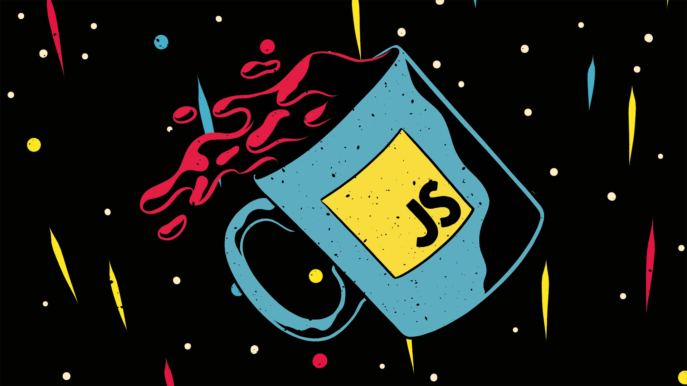

# JavaScript basics 2018

El proyecto del curso se encuentra en otro repositorio. Puedes visitarlo en: [UltiRequiem/SimonDice.js](https://ultirequiem.github.io/SimonDice.js)

Puedes encontrar alguna de mis notas en [others/](./others/).

El curso se encuentra en: [Platzi](https://platzi.com/clases/fundamentos-javascript-2018)

</body>
